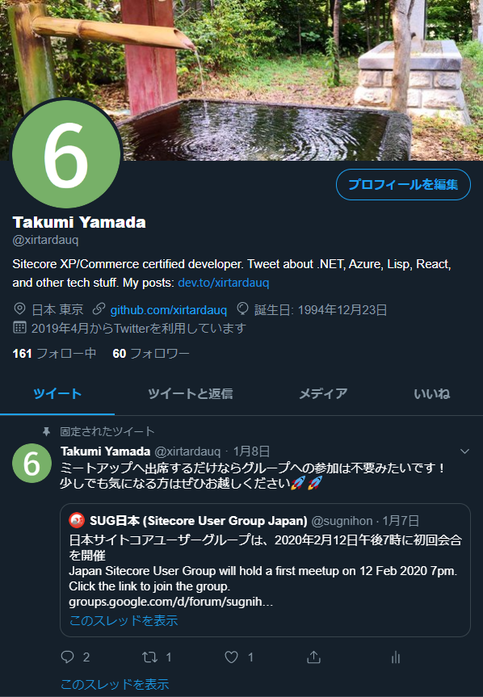
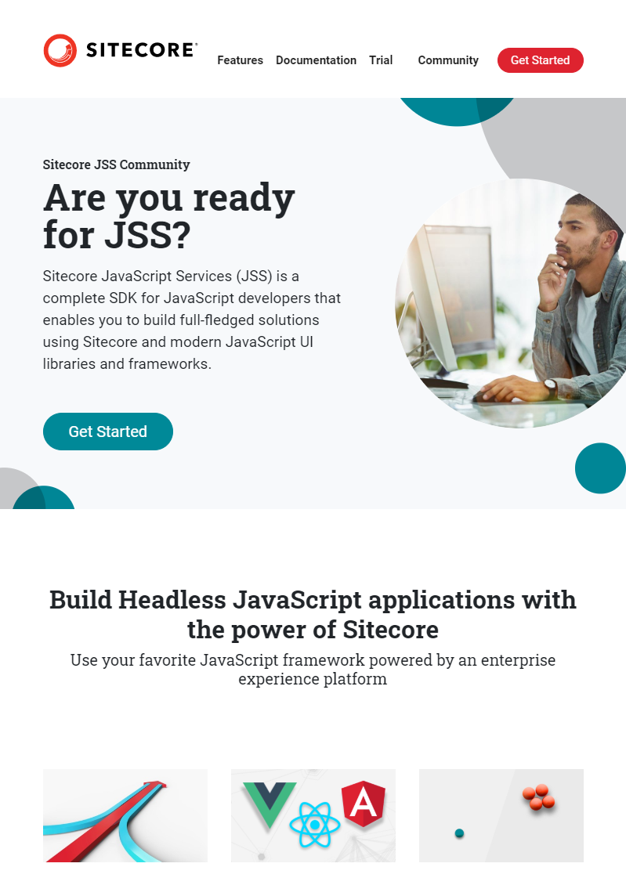
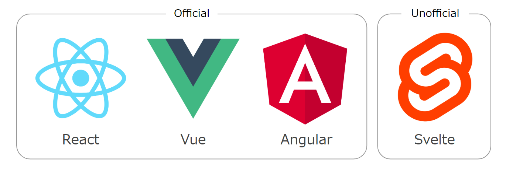
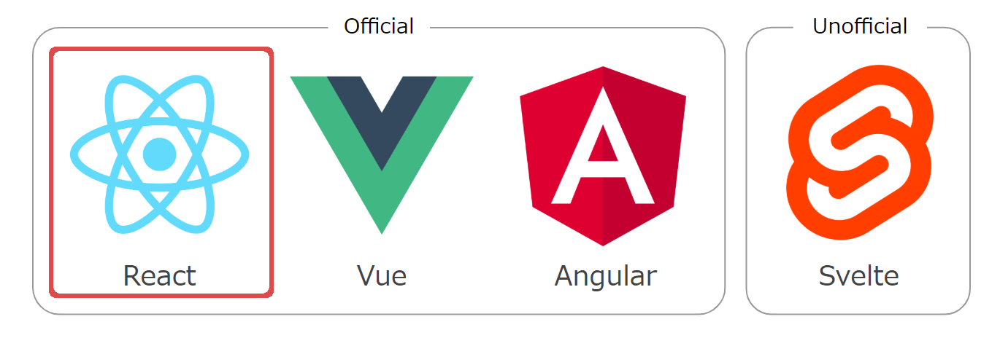
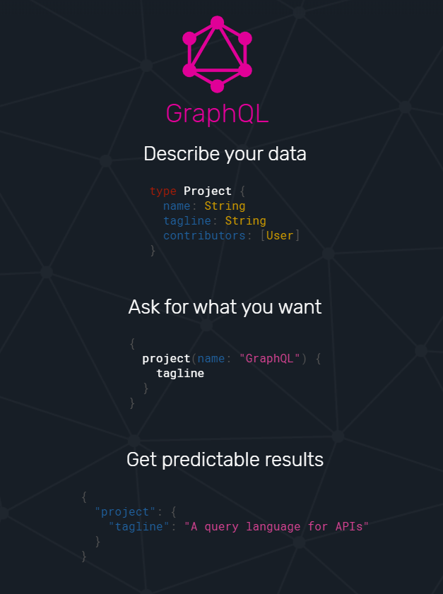

<!-- _paginate: false -->

# <!-- fit -->Sitecore JSS + GraphQLで検索機能を作る:mag_right:

Sitecore User Group Japan 1st meetup

---

# <!-- fit -->:tada::congratulations:SUG日本:tokyo_tower::sushi:

---

## 自己紹介
- 山田拓実
- イースト株式会社 (2017/4 ~)
  - Sitecore開発者
- Twitter: [@xirtardauq](https://twitter.com/xirtardauq)
- GitHub: https://github.com/xirtardauq

---

## アジェンダ
- Sitecore JSSの説明
  - デモ - ページの作成
- GraphQLの説明
  - デモ - 検索機能の作成

---

## Sitecore **J**ava**S**cript **S**ervice
- JavaScriptでSitecoreを開発するためのSDK
- MVC, SXAに次ぐもう一つの開発手段
- SXAやFormsとの連携/統合も可能
- パーソナライズ等の機能も使える

---

## 対応フレームワーク
公式/非公式で様々なフロントエンドフレームワークに対応している。

---

## 対応フレームワーク
Reactがおすすめ（情報、サンプルコードの量が多い）。

---

## 開発ワークフロー
JSSでは2つの開発ワークフローが用意されている。

### [Code-First](https://jss.sitecore.com/docs/fundamentals/dev-workflows/code-first)
テンプレートやページ、レイアウトの設定、コンポーネントの実装をコード側で行う。デプロイすることでSitecore上にインポートされる。

### [Sitecore-First](https://jss.sitecore.com/docs/fundamentals/dev-workflows/sitecore-first)
テンプレートやページ、レイアウトの設定は従来通りSitecore上で行い、コンポーネントの実装はコード側で行う。

---

## アプリケーションモード
JSSではアプリケーションの実行方法が複数用意されている。
- [Disconnected developer mode](https://jss.sitecore.com/docs/fundamentals/application-modes#disconnected-developer-mode)
  - ローカルにホスト&モックサーバーからコンテンツを取得。制限あり。
- [Connected developer mode](https://jss.sitecore.com/docs/fundamentals/application-modes#connected-developer-mode)
  - ローカルにホスト&SitecoreからAPI経由でコンテンツを取得。
- [Integrated mode](https://jss.sitecore.com/docs/fundamentals/application-modes#integrated-mode)
  - Sitecore上にホスト。本番用。

---

### デモ - ページの作成
- Code-Firstでニュースページを作成します。
  - `/news`: ニューストップ
  - `/news/:news-name`: ニュースページ
- サンプルコード: https://github.com/xirtardauq/sugjp-jss-sample

---

## GraphQL

---

## スキーマ

---

## デモ - 検索機能の作成
- Searchスキーマの有効化
- SearchBoxコンポーネントの作成
  - searchTermステートと、clickイベントハンドラの追加
- 検索クエリの作成
  - xQuery Builderの使い方
  - useQueryとuseLazyQuery

---

# リンク
- [Documentation | Sitecore JSS Documentation](https://jss.sitecore.com/docs)
- Sitecore Slack Community
  - [Join Sitecore Chat](https://docs.google.com/forms/d/1bAVDgP5-FhFh8ohPchHtifq-rz7EBkuPojAzdEofJyo/viewform?edit_requested=true)
  - [Sitecore Slack Community Guidelines & Help | jammykam](https://jammykam.wordpress.com/2018/02/26/sitecore-slack-community-guidelines/)
- [Sitecore JavaScript Services クイックスタート - YouTube](https://www.youtube.com/playlist?list=PL35wZQvLcxOisI2D_0VFpmjzd255StIwg)
- [Takumi Yamada, Software developer | SlideShare](https://www.slideshare.net/ssuser81a10f)
- [Takumi Yamada - DEV Community 👩‍💻👨‍💻](https://dev.to/xirtardauq)

---

# SUG日本メンバー募集中！
- [SUG日本 - Google グループ](https://groups.google.com/forum/#!forum/sugnihon)
- [SUG日本 (Sitecore User Group Japan)（@sugnihon） / Twitter](https://twitter.com/sugnihon)
