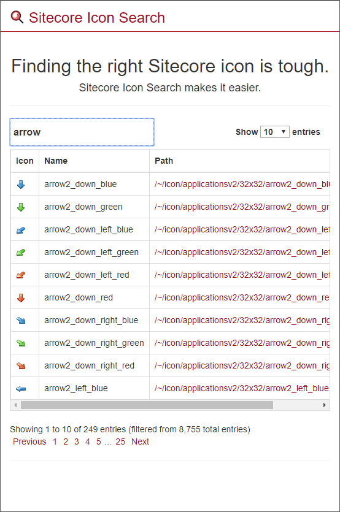
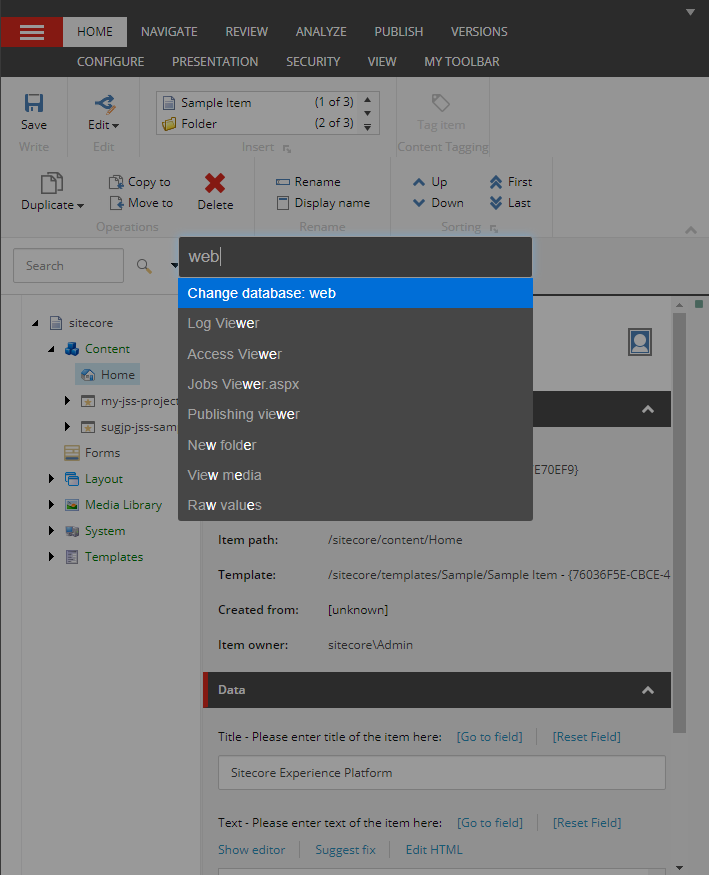
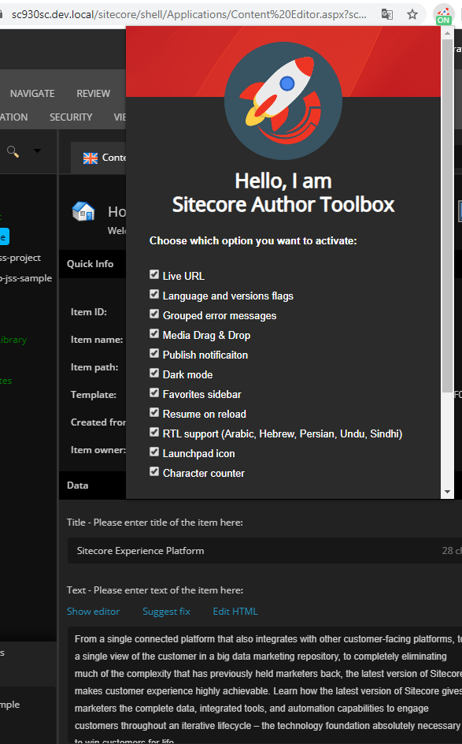

<!-- _paginate: false -->

# <!-- fit -->Sitecoreの作業効率を爆上げするブラウザ拡張機能:rocket:

---

# <!-- fit -->:tada::congratulations:SUG日本:tokyo_tower::sushi:

---

## :apple:山田拓実 (Yamada, Takumi)
- イースト株式会社 (2017/4 ~)
  - Sitecore開発者
- Twitter: [@xirtardauq](https://twitter.com/xirtardauq)
- GitHub: https://github.com/xirtardauq
- DEV: https://dev.to/xirtardauq

---

# <!-- fit -->&nbsp;&nbsp; Sitecore Icon Search&nbsp;&nbsp;

---

## :mag:Sitecore Icon Search
Sitecoreのアイコンを検索するための拡張機能

- 地味に面倒なアイコン設定作業に重宝する
- 検索 → IconフィールドにコピペでOK
- ウェブサイトからも利用可能
  - https://sitecoreicons.com/
- Chrome, Firefoxに対応

<!-- 
メモ：
Sitecore Rocksにはデフォルトで検索機能がある
-->

---

# <!-- fit -->&nbsp;&nbsp; Sitecore Extensions&nbsp;&nbsp;

---

## :gear:Sitecore Extensions
Sitecoreに様々な機能を追加する拡張機能

- **ランチャー**からコマンドを実行する独特なUIが特徴
  - Adminツールへの移動
  - データベースの切り替え, etc.
- ツリーの自動展開機能が地味に便利
- Chrome, Firefox, Opera, Vivaldiに対応

<!-- 
メモ：
Sitecore 7.0 - 8.2がサポート範囲。9.xでも一応動く。
-->

---

# <!-- fit -->&nbsp;&nbsp; Sitecore Author Toolbox&nbsp;&nbsp;

---

## :rocket:Sitecore Author Toolbox
コンテンツ作成に便利な機能を追加する拡張機能

- 選択アイテムの復元機能が便利
- その他にも多くの機能が実装されている
  - メディアのDrag&Drop
  - パブリッシュ完了通知
- ダークモードがかっこいい
- Chromeに対応
  - [Safari, Firefoxにも対応するかも](https://twitter.com/uquaisse/status/1221700172507439106)

<!-- 
メモ：
開発が活発。
私の作った機能が一部導入された。
-->

---

## :link:リンク
- [About - Sitecore Icon Search](https://sitecoreicons.com/about)
- [Sitecore Extensions - GitHub](https://github.com/alan-null/sc_ext)
- [Sitecore Author Toolbox - GitHub](https://github.com/ugo-quaisse/sitecore-author-toolbox)
